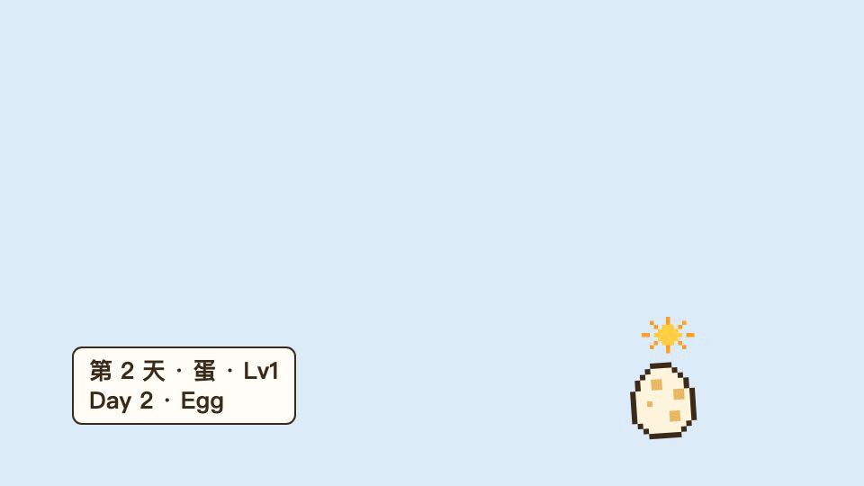
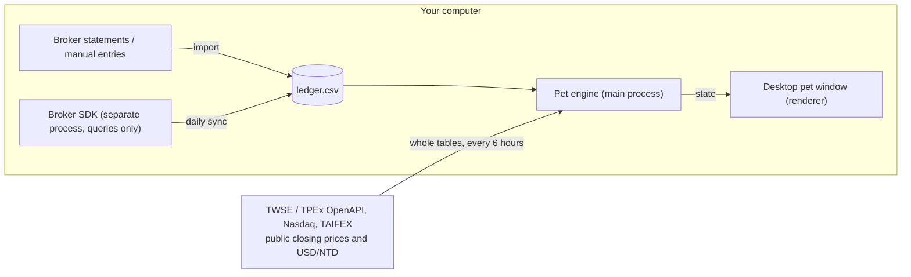
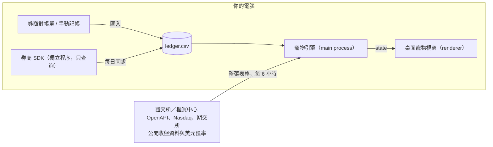

# 🥚 NestEgg（存蛋）

[](https://github.com/apapp45455/nestegg/actions/workflows/ci.yml)



**[English](#english)** · **[繁體中文](#繁體中文)**

## English

> Raise a desktop pet that grows from your real investment records.
> Open source, local-only and read-only: your data never leaves your computer. Runs on macOS and Windows.

> [!WARNING]
> This project is a **toy**, not an investment tool, and nothing in it is investment advice. The pet only reflects your investing *behavior*; it says nothing about whether any security is good or bad.

The app's menus and windows are in Traditional Chinese. This guide gives the Chinese label followed by an English translation, for example "寵物設定…" (Pet settings).

### What is this

The fun of 90s virtual pets was "care × time → a pet that grows into its own shape". NestEgg applies the same idea to investing: every on-time regular contribution and every day you hold for the long term becomes food for your pet.

The pet is a small, transparent, always-on-top window that sits in a corner of your desktop:

- **Drag** it wherever you like
- **Click** it to see how many days old it is, how big it is and whether it has eaten
- **Right-click** it to import trades, export a backup, edit the ledger by hand, set up recurring plans, open pet settings or quit

### Core idea: separate what you control from what the market gives

You can't decide whether the market goes up or down, so it shouldn't decide whether your pet lives or dies. NestEgg only rewards what you control (**discipline, patience and diversification**). Market swings are just the weather your pet lives in.

#### What you control → how the pet grows

| Pet state | Investing behavior | Status |
|---|---|---|
| 📏 Size | Total principal you've put in (not market value, so it doesn't shrink in a crash) | ✅ |
| 🍚 Fullness | Whether your regular contributions are on time; missing one makes it hungry | ✅ |
| 🎂 Age | Days held; growth stages only come with time and can't be bought | ✅ |
| 🥗 Balanced diet | How diversified your holdings are; going all-in on one stock is like eating only one food | Planned |
| 🍬 Too many snacks | Frequent short-term trading, chasing highs and panic selling → tummy ache (but it won't die) | Planned |

#### Current rules

All defaults are defined at the top of [`engine/index.js`](engine/index.js); change them there.

| Rule | Value |
|---|---|
| Hatching | 7 days after your first buy: egg → baby |
| Adulthood | 365 days after your first buy: baby → adult |
| Size | Principal under NT$30,000 is Lv1; NT$30,000 Lv2, NT$100,000 Lv3, NT$300,000 Lv4, NT$1,000,000 Lv5 |
| Principal | Purchase amount + fees; a sale removes shares at **average cost**, so the sale price doesn't matter |
| Fullness | One period = 31 days, plus a 7-day grace period; each missed period costs one bowl (🍚🍚🍚 → minimum 0). **It never starves to death** |
| Weather | Index up or flat ☀️ sunny; down 🌧️ rain; down 3% or more 🌀 typhoon. The index is the TAIEX, or the S&P 500 when more of your principal is in US stocks |
| Mood | Your holdings up 1% or more on the day 😊 happy (bounces faster, ^ ^ eyes); down 1% or more 😢 sad (droopy eyes, a tear); otherwise calm |
| Fur | Market value 5% or more above cost ✨ shiny; 5% or more below cost dull; otherwise normal |

> The speech bubble only shows the level, mood and fur, never your amounts or returns, because anyone walking past can see a desktop pet.

Right-click → "寵物設定…" (Pet settings) lets you adjust the **contribution period** (weekly, every two weeks, monthly, quarterly), the **grace days**, the **size thresholds**, and the **thresholds** for weather, mood and fur, and whether to look up US price history (see US stocks below). The table above shows the defaults. Hatching and adulthood depend only on time and can't be adjusted. Settings are stored in `settings.json` in the NestEgg data folder, which only records values that differ from the defaults.

#### What the market gives → only weather, mood and fur

Price moves only change how the pet looks *today*. They **never affect growth, size or health**. When the market changes the next day, the pet changes with it, and nothing accumulates.

| Environment | Source | Status |
|---|---|---|
| ☀️ 🌧️ 🌀 Weather | The index change on the latest trading day: the TAIEX, or the S&P 500 when more of your principal is in US stocks. In the rain the pet huddles and barely moves; in a typhoon it shivers | ✅ |
| 😊 😐 😢 Mood | Your holdings' change on the latest trading day | ✅ |
| ✨ Fur | Your holdings' market value compared with their cost (unrealized gain or loss) | ✅ |
| 🍎 Fruit | Drops when you receive a dividend; you can choose to reinvest it (feed it to the pet) | Planned |

**US stocks.** Tickers that don't start with a digit (VOO, QQQ, BRK.B) are priced from Nasdaq's public tables of every listed US stock and ETF, and converted to NT$ with TAIFEX's daily USD/NTD rate. VOO's change stands in for the S&P 500. Nasdaq's tables are sometimes a session behind; the speech bubble shows the date of the prices.

Contributions recorded without shares (recurring plans) count toward the mood at cost. For the fur, NestEgg needs the close on each debit day to know how much each contribution bought, and that takes one lookup per ticker. Turn on "逐檔查美股歷史價格" (Look up US price history) in pet settings to allow it. It's off by default because it tells Nasdaq which tickers you hold (never amounts, who you are, or when you started; the lookups always cover whole years from a fixed point). The gain is then the fund's return in US dollars, leaving out currency moves.

#### Evolution branches = investing styles (planned)

After a while, the pet evolves into a different form based on your behavior. **No form is better than another**; they just look different:

- 🌳 **Tree**: long-term regular ETF investing
- 🐔 **Egg-layer**: mostly collecting dividends
- 🦔 **Specialist**: a few concentrated individual stocks

#### Life cycle

- The pet **never dies because of losses**
- Stop contributing for a while → the pet **falls asleep**, and wakes up when you start again (planned)
- Sell everything → the pet **goes travelling**, and can come back later (planned)

### What NestEgg deliberately doesn't do

- ❌ Leaderboards, performance comparisons or sharing results
- ❌ Rating or recommending any stock or ETF
- ❌ Any order or trading features
- ❌ Cloud accounts or server-side data storage
- ❌ Ads, referral links or paid unlocks

### Privacy

- All your data lives in a single CSV file on your computer:
  - macOS: `~/Library/Application Support/NestEgg/ledger.csv`
  - Windows: `%APPDATA%\NestEgg\ledger.csv`

  Recurring plans and their sells (`plans.json`) and pet settings (`settings.json`) are kept in the same folder.
- There is no backend server, and no user data is collected
- Only two things go online:
  - Downloading **public** closing prices from TWSE and TPEx (for weather, mood and fur), at most once every 6 hours; with US holdings, also Nasdaq's tables of every US stock and ETF and TAIFEX's exchange rates. It always downloads the whole table and matches it on your computer, so **which stocks you hold is never sent anywhere**. The one exception is opt-in: with "逐檔查美股歷史價格" (Look up US price history) on, the US tickers in your recurring plans are looked up one by one (see US stocks above)
  - "證券帳戶同步" (Broker account sync), only if you set it up. It only connects to that broker's own servers (for Sinopac, through a temporary server that the official program runs on your computer); for Interactive Brokers it also downloads the central bank's public exchange rates, the whole file
- Broker login details (for Fubon: your national ID number, API key and certificate password; the optional one-time history key is never stored) are encrypted with the system keychain (macOS Keychain / Windows DPAPI) and stored only on this computer

> [!TIP]
> Right-click → "匯出備份…" (Export backup) saves a copy of your ledger. The ledger is a plain CSV that any editor can open.

---

### Getting started

#### Install

Download the latest installer from the [Releases page](https://github.com/apapp45455/nestegg/releases/latest):

| System | File |
|---|---|
| macOS on Apple silicon (M1 or later) | `NestEgg-<version>-arm64.dmg` |
| Windows 10 or 11, 64-bit | `NestEgg Setup <version>.exe` |

There's no download for Intel Macs; [run from source](#run-from-source) or [build an installer yourself](#build-an-installer-yourself) instead.

NestEgg is a free open-source project, so the installers aren't signed with a paid developer certificate, and the system warns you the first time.

**macOS**

1. Open the `.dmg` and drag NestEgg into Applications
2. Open NestEgg. macOS says it can't verify the app; click "Done"
3. In System Settings → Privacy & Security, scroll down, click "Open Anyway" next to NestEgg and confirm. From then on it opens normally

If macOS instead says NestEgg "is damaged and can't be opened", run this once in Terminal, then open it again:

```bash
xattr -dr com.apple.quarantine /Applications/NestEgg.app
```

> [!NOTE]
> NestEgg shows up in the Dock. Clicking the icon makes the pet show a status bubble (handy when you can't find it), and right-clicking the icon gives you import, export, broker sync and more.
>
> The pet stays on the desktop it's on. When another app is full screen (for example, a video), the pet doesn't cover it, and it comes back when you leave full screen.
>
> By default, clicking the wallpaper makes macOS move all windows aside (including the pet) to show the desktop; click the wallpaper again to bring them back. To turn this off, go to System Settings → Desktop & Dock → "Click wallpaper to reveal desktop" and choose "Only in Stage Manager".

**Windows**

1. Run `NestEgg Setup <version>.exe`. If "Windows protected your PC" appears, click "More info" → "Run anyway"
2. It installs for your user account only (no administrator rights needed), adds Start menu and desktop shortcuts, and starts NestEgg. To uninstall, use Settings → Apps

> [!NOTE]
> CI builds the Windows installer and runs the end-to-end tests on Windows, but it hasn't been tried by hand on a real Windows computer yet. If something looks wrong, please open an issue.

#### Build an installer yourself

```bash
npm install
npm run dist
```

This builds an installer for the operating system you run it on, in `dist/` (a `.dmg` on a Mac, `NestEgg Setup <version>.exe` on Windows). An installer you build on your own computer opens without the warnings above.

#### Run from source

You need [Node.js](https://nodejs.org/) 20 or later. The commands are the same on macOS and Windows:

```bash
npm install
npm start
```

1. The pet appears in the bottom-right corner of the screen (the first `npm start` downloads about 100 MB of Electron)
2. Right-click → "匯入交易紀錄 CSV…" (Import trades CSV). You can try it with [`example/ledger.csv`](example/ledger.csv)
3. Or right-click → "在資料夾中顯示帳本" (Show ledger in folder) and edit `ledger.csv` by hand (the pet updates within 10 seconds)
4. Watch your egg hatch 🐣

Importing the same file again never creates duplicate records, so it's safe to import your broker's full statement every time.

#### Trade record format

```csv
date,symbol,action,shares,amount,fee
2026-01-06,0050,buy,160,9600,20
2026-02-06,0050,buy,155,9610,20
2026-07-20,0050,dividend,0,1200,0
```

| Column | Description |
|---|---|
| `date` | Trade date, `YYYY-MM-DD` |
| `symbol` | Security code |
| `action` | `buy`, `sell` or `dividend` |
| `shares` | Number of shares (`0` for dividends) |
| `amount` | Total trade value or dividend amount (NT$) |
| `fee` | Fees and taxes |

UTF-8 files saved from Excel (with a BOM) and Windows line endings import fine. If something is wrong, it tells you which line, and nothing is half-imported.

#### Recurring plans

If you invest the same amount on the same day every month, set it up once: right-click → "定期定額計畫…" (Recurring plans), then enter the symbol, the monthly amount in NT$, the debit day and the start date. Every month the pet counts that contribution automatically, with nothing to import or type.

- This is the way to raise the pet on **US stocks bought through 複委託 (sub-brokerage)**: the Fubon, Sinopac and Cathay APIs can't read sub-brokerage accounts. It works for Taiwan stocks too
- Only the money is recorded (shares are 0). That's all the pet needs for age, fullness and size, and it moves the mood with the day's prices. For US tickers the fur can count it too, with US price history turned on (see US stocks above)
- Enter the NT$ amount actually debited, fees included; with foreign-currency settlement, an approximate NT$ amount is fine. A debit day on a weekend or holiday doesn't matter, thanks to the grace period
- To change the amount, give the plan an end date and add a new one. Ending a plan keeps its past contributions; deleting it removes them
- To sell shares a plan bought, record the sale in the same window (not in the ledger): the shares sold and the shares you held right before, both shown on your broker's holdings page. Plans record no shares, so that fraction of the symbol's principal is removed, single buys of the same symbol included, which is the average-cost rule
- Plans are kept in `plans.json` and added up whenever the pet is evaluated, so the ledger only holds your real records. If you also import, type or sync the same contributions, pick one source to avoid counting them twice

#### Fubon Securities auto-sync

Right-click → "證券帳戶同步…" (Broker account sync) → "富邦證券" (Fubon Securities). The setup wizard walks you through each step:

1. Have a Fubon Securities account
2. On Fubon's "金鑰管理與憑證匯出" (Key management and certificate export) page, apply for a web certificate and export it as a `.pfx` file (TCEM.exe doesn't run on a Mac; the web certificate works)
3. Download Fubon's Node.js SDK zip and give it to the wizard to install (the SDK belongs to Fubon and has no license that allows redistribution, so it isn't bundled with NestEgg)
4. In e櫃台 (Fubon's online service counter), sign the "應用程式介面(API)服務申請書暨聲明書" (API service application and declaration), then run the connection test **before 24:00 the same day**:

   ```bash
   node tools/fubon-connection-check.cjs
   ```

   It only logs in once with your account password and then logs out, and it stores nothing. Once you see "…此訊息表連線測試成功" ("…this message means the connection test succeeded"), you're done; the API is enabled by 9:00 the next day
5. Create an API key with only the "證券業務" (Securities account) permission. **Don't check "證券下單" (Securities orders)**, so even if the key leaks it can't be used to place orders
6. *(Optional)* Import your past trades. **If you don't need your history, skip this: syncing only needs "證券業務", not "證券下單".** Fubon only returns the trade history to keys with the "證券下單" order permission, so to import it, create a second key with "證券業務" + "證券下單" and the earliest expiry date Fubon allows (this key can place orders, so paste it nowhere else), paste it into the "歷史匯入用 API Key" (history import key) field, and delete it at Fubon once the import is done. NestEgg uses it for that one connection and never stores it
7. Once the API is enabled, enter your national ID number, API key and certificate to connect

After that, NestEgg syncs automatically once a day by reconciling your holdings: it reads your current Fubon holdings and compares them with what it recorded last time. More shares are recorded as a buy, fewer as a sell, dated the day NestEgg notices the change (a few days late if the computer was off; the pet's 7-day grace period absorbs that). Without imported history, your current holdings are recorded as bought on the day you connect, so the pet starts as an egg.

- The code only calls API-key login, `accounting.unrealizedGainsAndLoses` (holdings), `stock.filledHistory` (trade history, only with the one-time key) and logout. There are **no order-related calls**; see [`app/brokers/fubon-worker.cjs`](app/brokers/fubon-worker.cjs)
- Only cash holdings and trades count; margin buying, short selling and securities lending don't count toward principal
- The imported trade history doesn't include fees, so that part of the principal comes out slightly low; daily reconciliation uses Fubon's cost price. If you've imported Fubon statements as CSV, use one source or the other, not both, to avoid duplicates
- If auto sync would record a sell while Fubon returned no holdings at all, or answered "no data" (查無) for one of your accounts, it stops and asks you to confirm with "立即同步" (Sync now), in case the empty answer was temporary
- If auto-sync fails (for example, because the API key expired), it pauses and shows a notice next to the pet, instead of logging in again and again and getting your account locked
- The first time it syncs on a Mac, macOS asks whether NestEgg may use the keychain; choose "Always Allow"

#### Sinopac Securities auto-sync (experimental)

Right-click → "證券帳戶同步…" (Broker account sync) → "永豐金證券" (Sinopac Securities):

1. Have a Sinopac Securities account
2. On Sinopac's [API management page](https://www.sinotrade.com.tw/newweb/PythonAPIKey/), add an API key with "行情／資料" (Market data), "帳務" (Account) and "正式環境" (Production) checked. **Don't check "交易" (Trading)**
3. From [Shioaji's GitHub releases page](https://github.com/Sinotrade/Shioaji/releases/latest), download the command-line program archive for your operating system and give it to the wizard to install
4. Enter your API key and secret key, then connect and sync

Account queries need no CA certificate, no signed API agreement and no simulated-order test.

- During a sync, the official `shioaji` command-line program runs a temporary API server on your computer (it listens only on 127.0.0.1, on a random port, and shuts down right after the queries). Only account queries are called; see [`app/brokers/sinopac.js`](app/brokers/sinopac.js). No certificate is provided, so placing orders is impossible even if the key had trading permission
- Sinopac's API can't query past trades, so NestEgg rebuilds them from "current positions + their buy details" and "realized profit and loss + the matching buy details" ([`sync/sinopac.js`](sync/sinopac.js)). Shares you still hold use the position's average cost. Positions are a snapshot, so each sync replaces the whole batch that the previous sync wrote to the ledger
- Written from Sinopac's public documentation and sample data, and **not yet verified with a real account**. Checked with the real Shioaji 1.7.7 (macOS and Windows builds): the archive contents, startup flags, environment variables and API paths all exist, and a wrong key is recognized as a login failure. The returned data fields can only be confirmed with an account

#### Interactive Brokers auto-sync (experimental)

Right-click → "證券帳戶同步…" (Broker account sync) → "Interactive Brokers（盈透）". NestEgg uses IBKR's Flex Web Service, a reporting service: its token can only download the report you set up, never place an order.

1. In IBKR's Client Portal, go to Performance & Reports → Flex Queries and create an **Activity Flex Query**: only the **Trades** section with **Executions** (select all fields), format **XML**, and the default date format `yyyyMMdd`. Its number in the list is the **Query ID**
2. On the same page, open **Flex Web Service Configuration**, turn it on, choose how long the token lasts (up to a year) and click **Generate New Token**. Leave the IP restriction empty unless your IP never changes
3. Enter the token, the Query ID and the date to import from, then connect and sync

- Only executions of US-dollar stocks and ETFs are recorded; options, futures, forex and other currencies are skipped, and the sync says what it skipped. Symbols like `BRK B` become `BRK.B`
- US dollar amounts and commissions are converted to NT$ with the central bank's rate of the trade date (the [public daily rates](https://cpx.cbc.gov.tw/API/DataAPI/Get?FileName=BP01D01), downloaded whole). The central bank publishes a rate up to a week later, and a trade waits until its rate is out, so its amount never changes once it's in the ledger; recent trades show up a few days late, which the grace period absorbs. Each daily sync looks back 60 days to pick them up
- IBKR allows one report covering at most a year per request and ten requests a minute, so importing several years takes a minute or two
- Stock splits and positions transferred in from another broker aren't trades, so they aren't recorded
- Written from IBKR's public documentation and **not yet verified with a real account**. The error answers were checked against the real service with a made-up token

---

### Architecture



The pet engine is a **pure function** with no hidden state:

```js
petState = evaluate(ledger, today, market, settings)
```

The same data always raises the same pet, so the engine is fully testable and can "replay" the pet's whole life from egg to today (just set `today` to any day). `market` is optional; without it there's no weather, mood or fur, and growth is unaffected. `settings` is optional too; without it the defaults are used.

#### Repository layout

```
nestegg/
├── engine/    # Pet rules + CSV parsing (pure JS, no dependencies) and tests
├── sync/      # External data conversion (pure functions) and tests: broker data → ledger rows, TWSE / Nasdaq closing prices → market data
├── app/       # Electron desktop pet, context menu, pixel art, pet settings, broker setup wizard
│   └── brokers/   # One adapter per broker
└── example/   # Sample trade records
```

#### Tech stack

| Part | Technology |
|---|---|
| Engine | JavaScript (ESM), `node:test` |
| Desktop | Electron (transparent, frameless, always-on-top window) |
| Graphics | 16×16 pixel art on a canvas, scaled up with CSS |
| Broker sync | One adapter per broker; Fubon's next-generation API Node.js SDK (downloaded by the user) runs in an Electron utility process |

#### Adding a broker

The shared flow lives in [`app/brokers.js`](app/brokers.js): installing the SDK (it first copies the file to strip the macOS quarantine flag, then unpacks it), encrypting keys with the system keychain, running only one sync at a time, syncing automatically every day, pausing on failure, and merging rows into the ledger without duplicates. Each broker only implements what's different:

| File | Contents |
|---|---|
| `sync/<broker>.js` + tests | Broker trade data → ledger rows (a pure function; only cash trades count, and margin and short positions don't count toward principal) |
| `app/brokers/<broker>.js` | The adapter: `credentials(form)` checks the required fields, and `fetch({ creds, from, to, … })` queries trades and returns `{ rows, accounts, warnings }`. Snapshot brokers (which only report current positions) add `snapshot: true`: each sync returns every row they own, which replaces the previous batch, and `fetch` receives that batch as `previous`. Stocks with incomplete data go in the returned `skipped` list so the previous batch is kept. Fields that are only needed while connecting and must never be saved come from `connectOnly(form)` and reach `fetch` as `connectOnly`. If users have to download an SDK themselves, add `sdk: { label, version, unpack }`; if a certificate file is needed, add `cert`. Daily syncs look back 7 days from the last sync; a broker whose data arrives later sets `overlap` (days) |
| `app/setup-<broker>.html` | Setup steps and form (the field names are the fields passed to `credentials`; shares `setup.js` and `setup.css`) |
| `e2e/` | A fake SDK or server, so the end-to-end tests run without a real account |

Then add one line to `BROKERS` in `app/brokers.js` and the broker appears in the broker picker. The rule: **only call login and queries, and never put an order call anywhere in the code**. If the broker offers query-only keys, ask users to create one.

### Development

```bash
npm test          # Unit tests: engine, sync conversions, window placement
npm run test:e2e  # End-to-end tests: launches the real app with fake broker SDKs and cached market data, no network
npm start         # Start the pet
npm run dist      # Build an installer for the current operating system
```

#### CI/CD (GitHub Actions)

| Workflow | When it runs | What it does |
|---|---|---|
| [`ci.yml`](.github/workflows/ci.yml) | Push to main, every PR | Runs the unit and end-to-end tests on macOS and Windows and builds the installers (downloadable from the Actions page) |
| [`release.yml`](.github/workflows/release.yml) | Pushing a `v*` tag | Builds the macOS `.dmg` and Windows `.exe` and creates a GitHub Release |
| [`claude-review.yml`](.github/workflows/claude-review.yml) | Opening or updating a PR | Claude Code reviews the PR against the project rules (read-only, privacy, data safety, cross-platform) and leaves comments |

Claude Code Review needs the repository secret `CLAUDE_CODE_OAUTH_TOKEN` (generate it with `claude setup-token`). PRs from forks can't access secrets, so their review is skipped automatically.

---

### Roadmap

- [x] **Phase 0 Rule design**: rules table, CSV schema, license and disclaimer
- [x] **Phase 1 Engine MVP**: size, fullness and age; egg → baby → adult
- [x] **Phase 2 Playable desktop pet**: CSV import, pixel-art graphics, local storage, backup export
- [ ] **Phase 3 Play with it for a month**: only tune the numbers, no new features
- [ ] **Phase 4 Automation**: Fubon Securities sync ✅, weather/mood/fur ✅, Windows installer (macOS ✅)
  - Broker integration status:
    - Fubon Securities: done; login and permissions verified with a real account. Fubon only returns the trade history to keys with the 證券下單 (order) permission, so daily sync reconciles holdings with the 證券業務 permission only, and the history is an optional one-time import. The holdings fields still need to be verified with a real account
    - Sinopac Securities: done, **not yet verified with a real account** (whether position details count in board lots or shares, and the price fields, are unconfirmed); the Shioaji program itself was tested with version 1.7.7 for startup and login failure
    - Interactive Brokers: done through the read-only Flex Web Service, **not yet verified with a real account** (the report fields follow IBKR's documentation; error answers were checked against the real service)
    - E.SUN Securities: **not built and not verified** (there's no E.SUN account to test with, and its login would require storing the brokerage account password; to be evaluated when it's built)
- [ ] **Phase 5 Extensions and open contributions**: balanced diet, snacks, evolution branches, dividend fruit, sleeping and travelling

### Contributing

Before opening a PR, please make sure that:

- [ ] There is no order-related code
- [ ] There are no leaderboards, performance comparisons, or text that rates specific securities
- [ ] User data never leaves the user's computer
- [ ] No feature requires payment or sponsorship to unlock

Documentation, code comments, commit messages and PR descriptions are written in English. README.md also keeps a Traditional Chinese translation; the English version is the source of truth. Text shown in the app stays in Traditional Chinese.

### License

[MIT](LICENSE)

This project is not affiliated with any securities firm.

---

## 繁體中文

> 用你真實的投資紀錄，養一隻住在桌面上、會長大的電子寵物。
> 開源、純本機、唯讀 —— 你的資料永遠不會離開你的電腦。支援 macOS 與 Windows。

> [!WARNING]
> 本專案是一個**玩具**，不是投資工具，也不構成任何投資建議。寵物的狀態只反映你的投資「行為」，不代表任何標的的好壞。

---

### 這是什麼

90 年代的電子寵物之所以好玩，在於「照顧行為 × 時間 → 長出不同的樣子」。NestEgg 把同樣的概念套用在投資上：每一次準時的定期定額、每一天的長期持有，都會變成寵物的養分。

寵物是一個透明、永遠置頂的小視窗，待在你的桌面角落：

- **拖曳**：搬到你喜歡的位置
- **點一下**：看牠現在幾天大、多大隻、吃飽了沒
- **右鍵**：匯入交易紀錄、匯出備份、手動記帳、定期定額計畫、寵物設定、結束

### 核心理念：分開「你能控制的」與「市場給的」

股市漲跌不是你能決定的，所以它不該決定寵物的生死。NestEgg 只獎勵你能控制的事 —— **紀律、耐心、分散** —— 市場波動只是寵物所處的天氣。

#### 你控制的 → 決定寵物的成長

| 寵物狀態 | 對應的投資行為 | 狀態 |
|---|---|---|
| 📏 體型 | 累積投入的本金（不是市值，大跌時不會縮水） | ✅ |
| 🍚 飽足 | 定期投入是否準時；漏掉一期會肚子餓 | ✅ |
| 🎂 年齡 | 持有天數；成長階段只能靠時間，無法用錢加速 | ✅ |
| 🥗 營養均衡 | 持股分散程度；全押單一標的就像只吃同一種食物 | 規劃中 |
| 🍬 吃太多零食 | 短期頻繁買賣、追高殺低 → 肚子痛（但不會死） | 規劃中 |

#### 目前的數值表

全部定義在 [`engine/index.js`](engine/index.js) 最上方，調數值只需改那裡。

| 規則 | 數值 |
|---|---|
| 孵化 | 第一次買入後 7 天：蛋 → 幼年 |
| 成年 | 第一次買入後 365 天：幼年 → 成年 |
| 體型 | 本金 < 3 萬 Lv1、3 萬 Lv2、10 萬 Lv3、30 萬 Lv4、100 萬 Lv5 |
| 本金 | 買入金額 + 手續費；賣出時按**平均成本**扣除，賣價高低不影響 |
| 飽足 | 一期 = 31 天，另有 7 天寬限；每漏一期少一碗（🍚🍚🍚 → 最低 0），**不會餓死** |
| 天氣 | 指數上漲或平盤 ☀️ 晴；下跌 🌧️ 雨；跌 3% 以上 🌀 颱風。指數看加權指數；美股本金比較多時看 S&P 500 |
| 心情 | 持股當日漲 1% 以上 😊 開心（跳得比較快、^ ^ 瞇眼）；跌 1% 以上 😢 難過（眼睛垂下、掉眼淚）；其餘平靜 |
| 毛色 | 持股市值比成本高 5% 以上 ✨ 發亮；低 5% 以上 黯淡；其餘普通 |

> 氣泡裡只顯示 Lv 與心情毛色，不顯示你的金額或報酬率 —— 桌面寵物別人路過也看得到。

右鍵 →「寵物設定…」可以調**投入週期**（每週、每兩週、每月、每季）、**寬限天數**、**體型門檻**，以及天氣、心情、毛色的**門檻**，還有要不要逐檔查美股歷史價格（見下方「美股」）。上表是預設值。孵化、成年只看時間，不開放調整。設定存在 NestEgg 資料夾的 `settings.json`，只記跟預設不一樣的項目。

#### 市場給的 → 只影響天氣、心情、毛色

漲跌只改變寵物「今天的樣子」，**不影響成長、體型與健康**，隔天行情變了就跟著變，不會累積。

| 環境 | 來源 | 狀態 |
|---|---|---|
| ☀️ 🌧️ 🌀 天氣 | 指數最近一個交易日的漲跌：加權指數；美股本金比較多時看 S&P 500。下雨時寵物縮著不太動，颱風時發抖 | ✅ |
| 😊 😐 😢 心情 | 你的持股最近一個交易日的漲跌 | ✅ |
| ✨ 毛色 | 你的持股市值相對成本（未實現損益） | ✅ |
| 🍎 果實 | 收到配息時掉落；你可以選擇再投入（餵牠吃掉） | 規劃中 |

**美股。** 不是數字開頭的代號（VOO、QQQ、BRK.B）用 Nasdaq 公開的全部美股與 ETF 價格表計價，再用期交所每日的美元兌台幣匯率換成台幣。S&P 500 的漲跌用 VOO 代表。Nasdaq 的表有時會晚一個交易日，氣泡會顯示價格的日期。

沒有股數的投入（定期定額計畫）會以成本算進心情。毛色則要知道每個扣款日的收盤價，才算得出每次買到多少，這只能一檔一檔查。在寵物設定打開「逐檔查美股歷史價格」才會這樣查。預設關閉，因為 Nasdaq 會知道有人查了哪些代號（不會知道金額、你是誰或什麼時候開始買；查詢一律從固定的年初開始）。這樣算出的報酬是基金的美元報酬，不含匯率變動。

#### 進化分支 = 投資風格（規劃中）

養滿一段時間後，寵物會依照你的行為進化成不同型態。**型態沒有好壞之分**，只是不同的樣子：

- 🌳 **大樹型**：長期 ETF 定期定額
- 🐔 **下蛋型**：以領息為主
- 🦔 **特化型**：集中持有少數個股

#### 生命週期

- 寵物**永遠不會因為虧損而死掉**
- 停止投入一段時間 → 寵物**睡著**，恢復投入就會醒來（規劃中）
- 賣出全部持股 → 寵物**去旅行**，之後可以再回來（規劃中）

### 刻意不做的事

- ❌ 排行榜、績效比較、分享戰績
- ❌ 評價或推薦任何個股、ETF
- ❌ 任何下單或交易功能
- ❌ 雲端帳號、伺服器端資料儲存
- ❌ 廣告、導流、付費解鎖

### 隱私

- 所有資料只存在你電腦上的一個 CSV 檔：
  - macOS：`~/Library/Application Support/NestEgg/ledger.csv`
  - Windows：`%APPDATA%\NestEgg\ledger.csv`

  定期定額計畫與它的賣出紀錄（`plans.json`）、寵物設定（`settings.json`）也放在同一個資料夾。
- 沒有後端伺服器，不收集任何使用者資料
- 會連網的只有兩件事：
  - 下載證交所、櫃買中心**公開**的收盤資料（天氣、心情、毛色用），每 6 小時最多一次；有美股的話，也下載 Nasdaq 的全部美股與 ETF 價格表和期交所的匯率。一律下載整張表格、在本機比對，**你持有哪些股票不會送出去**。唯一的例外要你自己打開：開啟「逐檔查美股歷史價格」後，定期定額計畫裡的美股代號會一檔一檔查（見上方「美股」）
  - 「證券帳戶同步」（有設定才會），只連你設定的那家券商自己的伺服器（永豐是透過官方程式在本機開的暫時伺服器）；Interactive Brokers 另外會下載中央銀行公開的整份匯率資料
- 券商的登入資料（例如富邦的身分證字號、API Key 與憑證密碼；選用的一次性歷史匯入金鑰不會儲存）用系統鑰匙圈（macOS Keychain / Windows DPAPI）加密後只存在這台電腦

> [!TIP]
> 右鍵 →「匯出備份…」可以把帳本另存一份。帳本就是普通的 CSV，用任何編輯器都能打開。

---

### 開始玩

#### 安裝

到 [Releases 頁面](https://github.com/apapp45455/nestegg/releases/latest) 下載最新的安裝檔：

| 系統 | 檔案 |
|---|---|
| macOS，Apple 晶片（M1 以後） | `NestEgg-<版本>-arm64.dmg` |
| Windows 10 或 11，64 位元 | `NestEgg Setup <版本>.exe` |

Intel 晶片的 Mac 沒有現成的安裝檔，請改用[從原始碼執行](#從原始碼執行)或[自己打包安裝檔](#自己打包安裝檔)。

NestEgg 是免費的開源專案，安裝檔沒有付費的開發者簽章，所以第一次開啟時系統會警告。

**macOS**

1. 打開 `.dmg`，把 NestEgg 拖進「應用程式」
2. 打開 NestEgg。macOS 會說無法驗證這個 app，按「完成」
3. 到「系統設定 → 隱私權與安全性」，往下捲，在 NestEgg 旁邊按「強制打開」並確認。之後就能正常開啟

如果 macOS 說 NestEgg「已損毀，無法打開」，在「終端機」執行一次下面這行，再重新打開：

```bash
xattr -dr com.apple.quarantine /Applications/NestEgg.app
```

> [!NOTE]
> NestEgg 會出現在 Dock：點圖示寵物會冒出狀態氣泡（找不到牠時很好用），在圖示上按右鍵也有匯入、匯出、券商同步等選單。
>
> 寵物只待在它所在的那個桌面；其他 app 全螢幕時（例如看影片）不會擋在畫面上，離開全螢幕就回來。
>
> 在桌布上按一下時，macOS 預設會把所有視窗（包含寵物）推開以顯示桌面，再按一次桌布就會回來。不想要這個行為，可以到「系統設定 → 桌面與 Dock → 按一下背景圖片以顯示桌面」改成「僅在幕前調度中」。

**Windows**

1. 執行 `NestEgg Setup <版本>.exe`。如果出現「Windows 已保護您的電腦」，按「其他資訊」→「仍要執行」
2. 只會安裝在你的使用者帳號（不需要系統管理員權限），會建立開始功能表與桌面捷徑，並啟動 NestEgg。要移除的話，到「設定 → 應用程式」

> [!NOTE]
> Windows 安裝檔由 CI 打包，端到端測試也會在 Windows 上跑，但還沒有人在真的 Windows 電腦上手動裝過。如果有問題，歡迎開 issue。

#### 自己打包安裝檔

```bash
npm install
npm run dist
```

會在 `dist/` 產出你目前作業系統的安裝檔（Mac 是 `.dmg`，Windows 是 `NestEgg Setup <版本>.exe`）。在自己電腦上打包的安裝檔，開啟時不會出現上面的警告。

#### 從原始碼執行

需要 [Node.js](https://nodejs.org/) 20 以上，macOS 與 Windows 指令相同：

```bash
npm install
npm start
```

1. 寵物出現在螢幕右下角（第一次 `npm start` 會下載約 100 MB 的 Electron）
2. 右鍵 →「匯入交易紀錄 CSV…」，可以先拿 [`example/ledger.csv`](example/ledger.csv) 試玩
3. 或右鍵 →「在資料夾中顯示帳本」，直接編輯 `ledger.csv` 手動記帳（10 秒內寵物會更新）
4. 看你的蛋孵化 🐣

重複匯入同一份檔案不會產生重複紀錄，可以放心每次都匯入券商的完整對帳單。

#### 交易紀錄格式

```csv
date,symbol,action,shares,amount,fee
2026-01-06,0050,buy,160,9600,20
2026-02-06,0050,buy,155,9610,20
2026-07-20,0050,dividend,0,1200,0
```

| 欄位 | 說明 |
|---|---|
| `date` | 交易日期，`YYYY-MM-DD` |
| `symbol` | 證券代號 |
| `action` | `buy`、`sell` 或 `dividend` |
| `shares` | 股數（配息填 `0`） |
| `amount` | 成交總金額或配息金額（新台幣） |
| `fee` | 手續費與稅金 |

Excel 另存的 UTF-8（含 BOM）與 Windows 換行都可以直接匯入。格式有錯時會告訴你第幾行，不會匯入一半。

#### 定期定額計畫

每月固定日期、固定金額的投入，設定一次就好：右鍵 →「定期定額計畫…」，填標的代號、每月台幣金額、扣款日和開始日期。之後每個月寵物會自動算進這筆投入，不用匯入、也不用手動記帳。

- **複委託買的美股**用這個方式養寵物：富邦、永豐、國泰的 API 都查不到複委託帳戶。台股也可以用
- 只記投入的金額（股數是 0）。寵物的年齡、飽足、體型只需要這些，心情也會跟著當天的漲跌變。美股打開「逐檔查美股歷史價格」後，毛色也會算進去（見上方「美股」）
- 金額填每月實際扣款的台幣（含手續費）；外幣交割的話，填大約的台幣金額就好。扣款日遇到週末或假日也沒關係，寵物有寬限
- 要改金額：在原計畫填上結束日期，再新增一個。填結束日期會保留已經記的投入；刪除計畫則會一起拿掉
- 賣出定期定額買的股票，在同一個視窗記一筆賣出（不要記到帳本）：填賣出股數和賣出前的持有股數，券商 App 的庫存頁都看得到。計畫不記股數，所以寵物會按這個比例扣掉這一檔的本金，包含同一檔單筆買的部分，也就是平均成本法
- 計畫存在 `plans.json`，每次計算寵物時才加總，所以帳本裡只有你的真實紀錄。同一筆投入如果也用匯入、手動記帳或券商同步，請擇一來源，以免重複

#### 富邦證券自動同步

右鍵 →「證券帳戶同步…」→ 選「富邦證券」，設定精靈會一步步帶你完成：

1. 準備富邦證券帳戶
2. 在富邦「金鑰管理與憑證匯出」頁申請網頁憑證並匯出 `.pfx`（Mac 不能用 TCEM.exe，用網頁憑證即可）
3. 下載富邦 Node.js SDK 的 zip 交給精靈安裝（SDK 屬於富邦、沒有開放散布的授權條款，所以不隨 NestEgg 打包）
4. 到 e櫃台簽署「應用程式介面(API)服務申請書暨聲明書」，**當天 24:00 前**做連線測試：

   ```bash
   node tools/fubon-connection-check.cjs
   ```

   只會用帳號密碼登入一次再登出，不儲存任何資料。看到「…此訊息表連線測試成功」就完成了，API 隔天 9:00 前開通
5. 建立 API Key，權限只勾「證券業務」，**不要勾「證券下單」**——就算外洩也不能拿來下單
6. （選用）匯入過去的成交紀錄。**不需要歷史紀錄就跳過這一步：同步只需要「證券業務」，不用開「證券下單」。**富邦要有「證券下單」權限的金鑰才查得到成交紀錄，所以要匯入的話，另外建立一把勾「證券業務」＋「證券下單」的金鑰（到期日選最近的日期；這把金鑰能下單，請只貼在這裡），貼到「歷史匯入用 API Key」，匯入完成後到富邦把它刪除。NestEgg 只在這次連線時用它，不會儲存
7. API 開通後，輸入身分證字號、API Key、憑證，連線並同步

設定好之後，NestEgg 每天會自動對帳一次：讀你目前的富邦持股，和上次記下的比對，股數變多記成買進、變少記成賣出，日期是 NestEgg 發現變化的那天（電腦沒開的日子會晚幾天，寵物有 7 天寬限，不太受影響）。沒有匯入歷史的話，目前的持股會記成連線那天買進，寵物從蛋開始。

- 程式只呼叫 API Key 登入、`accounting.unrealizedGainsAndLoses`（持股）、`stock.filledHistory`（成交紀錄，只有一次性金鑰會用到）與登出，**沒有任何下單相關的呼叫**，見 [`app/brokers/fubon-worker.cjs`](app/brokers/fubon-worker.cjs)
- 只算現股；融資、融券、借券不算本金
- 匯入的歷史成交紀錄不含手續費，所以這部分本金會略少一點；每天對帳用的是富邦的成本價。用 CSV 匯入過富邦對帳單的話，兩種來源擇一，以免重複
- 自動同步要記一筆賣出、而富邦這次完全沒有回傳持股，或有帳戶回「查無」時，會先停下來請你按「立即同步」確認，以免是暫時查不到
- 自動同步失敗（例如 API Key 過期）會暫停並在寵物旁提示，不會反覆登入導致帳號被鎖
- Mac 第一次同步時會詢問 NestEgg 能否使用鑰匙圈，請選「永遠允許」

#### 永豐金證券自動同步（實驗性）

右鍵 →「證券帳戶同步…」→ 選「永豐金證券」：

1. 準備永豐金證券帳戶
2. 到永豐理財網 [API 管理頁](https://www.sinotrade.com.tw/newweb/PythonAPIKey/) 新增 API Key，勾「行情／資料」「帳務」「正式環境」，**不要勾「交易」**
3. 到 [Shioaji 的 GitHub 下載頁](https://github.com/Sinotrade/Shioaji/releases/latest) 下載自己作業系統的命令列程式壓縮檔，交給精靈安裝
4. 輸入 API Key 與 Secret Key，連線並同步

只查帳務不用 CA 憑證，也不用簽署 API 約定書或做模擬下單測試。

- 同步時用官方的 `shioaji` 命令列程式在本機開一個暫時的 API 伺服器（只聽 127.0.0.1、隨機埠、查完就關），只呼叫帳務查詢，見 [`app/brokers/sinopac.js`](app/brokers/sinopac.js)。沒有提供憑證，就算金鑰有交易權限也不能下單
- 永豐的 API 查不到過去的成交紀錄，所以用「目前持倉＋買進明細」與「已實現損益＋對到的買進明細」拼回買賣紀錄（[`sync/sinopac.js`](sync/sinopac.js)）；還沒賣的股票用持倉平均成本計算。持倉是快照，每次同步會整批取代上次寫進帳本的那批
- 照永豐公開文件與範例資料寫成，**還沒用真實帳戶驗證過**。已用真的 Shioaji 1.7.7（macOS、Windows 版）確認：壓縮檔內容、啟動參數、環境變數、用到的 API 路徑都存在，金鑰錯誤時會被認成登入失敗。查到的資料欄位要有帳戶才能確認

#### Interactive Brokers 自動同步（實驗性）

右鍵 →「證券帳戶同步…」→「Interactive Brokers（盈透）」。NestEgg 用 IB 的 Flex Web Service，這是報表服務：它的金鑰只能下載你設定好的報表，不能下單。

1. 到 IB 的 Client Portal → Performance & Reports → Flex Queries，建立一個 **Activity Flex Query**：只勾 **Trades** 並選 **Executions**（欄位全選），格式選 **XML**，日期格式保留預設的 `yyyyMMdd`。列表上它的編號就是 **Query ID**
2. 同一頁打開 **Flex Web Service Configuration**，啟用、選金鑰的有效期限（最長一年），按 **Generate New Token**。除非你的 IP 不會變，IP 限制請留空
3. 填入金鑰、Query ID 和從哪天開始匯入，連線並同步

- 只記美元計價的股票與 ETF 成交；選擇權、期貨、外匯與其他幣別會略過，同步完成時會告訴你略過了什麼。`BRK B` 這類代號會記成 `BRK.B`
- 美元金額與手續費用中央銀行公布的成交日匯率換成台幣（[公開的每日匯率](https://cpx.cbc.gov.tw/API/DataAPI/Get?FileName=BP01D01)，整份下載）。央行最晚約一週後才公布，交易會等到當天匯率公布才記，所以寫進帳本後金額不會再變；最近幾天的交易會晚幾天出現，寵物有寬限。每天同步會往回查 60 天把它們補上
- IB 每次最多查一年、每分鐘最多 10 次，匯入好幾年的紀錄要等一兩分鐘
- 股票分割、從其他券商轉入的持股不是成交紀錄，不會記進帳本
- 照 IB 公開文件寫成，**還沒用真實帳戶驗證過**。錯誤回應已用一組假的金鑰對真實服務確認過

---

### 架構



寵物引擎是一個**純函式**，沒有隱藏狀態：

```js
petState = evaluate(ledger, today, market, settings)
```

同一份資料永遠養出同一隻寵物，因此引擎可以完整測試，也能「回放」寵物從蛋到現在的一生（把 `today` 換成任何一天即可）。`market` 可以省略；省略時沒有天氣、心情與毛色，成長完全不受影響。`settings` 也可以省略，省略時用預設值。

#### Repo 結構

```
nestegg/
├── engine/    # 寵物規則 + CSV 解析（純 JS，無依賴）與測試
├── sync/      # 外部資料轉換（純函式）與測試：富邦成交紀錄 → 帳本列、證交所與 Nasdaq 收盤資料 → 行情
├── app/       # Electron 桌面寵物、右鍵選單、像素圖、券商設定精靈
│   └── brokers/   # 每家券商一個 adapter
└── example/   # 範例交易紀錄
```

#### 技術選型

| 部分 | 技術 |
|---|---|
| 引擎 | JavaScript（ESM）、`node:test` |
| 桌面 | Electron（透明、無邊框、置頂視窗） |
| 畫面 | Canvas 16×16 像素圖，CSS 放大 |
| 券商同步 | 每家券商一個 adapter；富邦新一代 API Node.js SDK（使用者自行下載），在 Electron utility process 執行 |

#### 新增一家券商

共用的流程都在 [`app/brokers.js`](app/brokers.js)：安裝 SDK（先複製一份去掉 macOS quarantine 再解壓縮）、金鑰用系統鑰匙圈加密保存、同一時間只跑一個同步、每天自動同步、失敗就暫停、合併去重寫進帳本。每家券商只要寫自己不一樣的地方：

| 檔案 | 內容 |
|---|---|
| `sync/<券商>.js` ＋ 測試 | 券商回傳的成交紀錄 → 帳本列（純函式；只算現股，融資融券不算本金） |
| `app/brokers/<券商>.js` | adapter：`credentials(form)` 檢查要填的欄位、`fetch({ creds, from, to, … })` 查成交紀錄回傳 `{ rows, accounts, warnings }`；快照型券商（查得到的是目前持倉）加 `snapshot: true`：每次同步回傳它擁有的全部列、取代上一批，`fetch` 會從 `previous` 拿到上一批；資料不完整的股票放進回傳的 `skipped` 就會沿用上一批；只在連線時需要、不能儲存的欄位由 `connectOnly(form)` 產生，以 `connectOnly` 傳給 `fetch`；有要使用者自行下載的 SDK 就加 `sdk: { label, version, unpack }`，要選憑證檔就加 `cert`；每天同步會從上次同步往回重疊 7 天，資料比較晚到的券商可以用 `overlap`（天數）調長 |
| `app/setup-<券商>.html` | 設定步驟說明與表單（欄位名稱就是送給 `credentials` 的欄位，共用 `setup.js`、`setup.css`） |
| `e2e/` | 假的 SDK 或伺服器，讓端到端測試不用真帳戶也能跑 |

再到 `app/brokers.js` 的 `BROKERS` 加一行，券商選擇頁就會出現它。原則：**只呼叫登入與查詢，程式裡不放任何下單呼叫**；能申請「只有查詢權限」的金鑰就請使用者這樣申請。

### 開發

```bash
npm test          # 單元測試：引擎、同步轉換、視窗位置
npm run test:e2e  # 端到端測試：真的啟動 app，用假富邦 SDK 與行情快取，不連網
npm start    # 啟動寵物
npm run dist      # 打包成目前作業系統的安裝檔
```

#### CI／CD（GitHub Actions）

| Workflow | 什麼時候跑 | 做什麼 |
|---|---|---|
| [`ci.yml`](.github/workflows/ci.yml) | push 到 main、每個 PR | 在 macOS 與 Windows 上跑單元測試、端到端測試，並打包安裝檔（可在 Actions 頁面下載） |
| [`release.yml`](.github/workflows/release.yml) | 推 `v*` tag | 打包 macOS `.dmg` 與 Windows `.exe`，建立 GitHub Release |
| [`claude-review.yml`](.github/workflows/claude-review.yml) | 開 PR、更新 PR | Claude Code 依專案守則（唯讀、隱私、資料安全、跨平台）審查並留言 |

Claude Code Review 需要在 repo 設定 secret `CLAUDE_CODE_OAUTH_TOKEN`（用 `claude setup-token` 產生）。從 fork 送來的 PR 拿不到 secret，會自動跳過審查。


---

### Roadmap

- [x] **Phase 0　規則設計**：數值表、CSV schema、授權與免責聲明
- [x] **Phase 1　引擎 MVP**：體型、飽足、年齡；蛋 → 幼年 → 成年三階段
- [x] **Phase 2　可玩的桌面寵物**：CSV 匯入、像素風畫面、本機儲存、匯出備份
- [ ] **Phase 3　自己玩一個月**：只調數值，不加功能
- [ ] **Phase 4　自動化**：富邦證券同步 ✅、天氣／心情／毛色 ✅、Windows 安裝檔（macOS ✅）
  - 券商串接狀態：
    - 富邦證券：已完成，已用真實帳戶驗證登入與權限。富邦要「證券下單」權限才查得到成交紀錄，所以每天改用「證券業務」權限對帳持股，歷史紀錄是選用的一次性匯入。持股欄位還要用真實帳戶驗證
    - 永豐金證券：已完成，**還沒用真實帳戶驗證**（持倉明細的張／股單位、價格欄位待確認）；Shioaji 程式本身已用 1.7.7 實測啟動與登入失敗
    - Interactive Brokers：用唯讀的 Flex Web Service 做好了，**還沒用真實帳戶驗證過**（報表欄位照 IB 的文件；錯誤回應已對真實服務確認過）
    - 玉山證券：**還沒做、也沒驗證**（目前沒有玉山帳戶可以測；登入需要存證券帳戶密碼，要做時再評估）
- [ ] **Phase 5　擴充與開放貢獻**：營養均衡、零食、進化分支、配息果實、睡著與旅行

### 貢獻

提交 PR 前，請確認符合以下守則：

- [ ] 沒有任何下單相關的程式碼
- [ ] 沒有新增排行榜、績效比較，或評價特定標的的文字
- [ ] 使用者資料沒有離開他的電腦
- [ ] 沒有任何功能需要付費或贊助才能解鎖

文件、程式註解、commit message 與 PR 說明一律用英文。README.md 另外保留繁體中文翻譯，以英文版為準。App 畫面上的文字維持繁體中文。

### 授權

[MIT](LICENSE)

本專案與任何證券商皆無合作或從屬關係。
