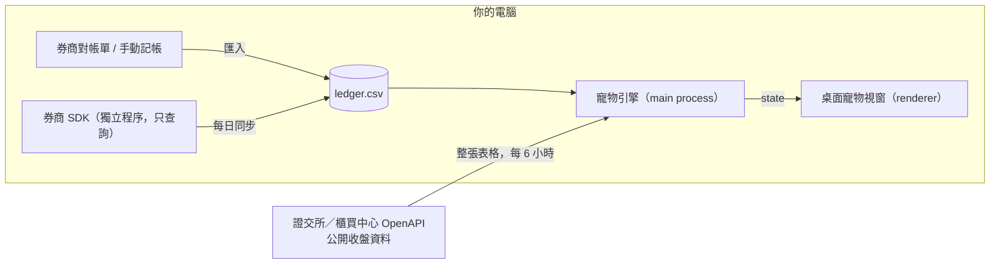

# 🥚 NestEgg（存蛋）

[](https://github.com/apapp45455/nestegg/actions/workflows/ci.yml)

> 用你真實的投資紀錄，養一隻住在桌面上、會長大的電子寵物。
> 開源、純本機、唯讀 —— 你的資料永遠不會離開你的電腦。支援 macOS 與 Windows。

> [!WARNING]
> 本專案是一個**玩具**，不是投資工具，也不構成任何投資建議。寵物的狀態只反映你的投資「行為」，不代表任何標的的好壞。

---

## 這是什麼

90 年代的電子寵物之所以好玩，在於「照顧行為 × 時間 → 長出不同的樣子」。NestEgg 把同樣的概念套用在投資上：每一次準時的定期定額、每一天的長期持有，都會變成寵物的養分。

寵物是一個透明、永遠置頂的小視窗，待在你的桌面角落：

- **拖曳**：搬到你喜歡的位置
- **點一下**：看牠現在幾天大、多大隻、吃飽了沒
- **右鍵**：匯入交易紀錄、匯出備份、手動記帳、結束

## 核心理念：分開「你能控制的」與「市場給的」

股市漲跌不是你能決定的，所以它不該決定寵物的生死。NestEgg 只獎勵你能控制的事 —— **紀律、耐心、分散** —— 市場波動只是寵物所處的天氣。

### 你控制的 → 決定寵物的成長

| 寵物狀態 | 對應的投資行為 | 狀態 |
|---|---|---|
| 📏 體型 | 累積投入的本金（不是市值，大跌時不會縮水） | ✅ |
| 🍚 飽足 | 定期投入是否準時；漏掉一期會肚子餓 | ✅ |
| 🎂 年齡 | 持有天數；成長階段只能靠時間，無法用錢加速 | ✅ |
| 🥗 營養均衡 | 持股分散程度；全押單一標的就像只吃同一種食物 | 規劃中 |
| 🍬 吃太多零食 | 短期頻繁買賣、追高殺低 → 肚子痛（但不會死） | 規劃中 |

### 目前的數值表

全部定義在 [`engine/index.js`](engine/index.js) 最上方，調數值只需改那裡。

| 規則 | 數值 |
|---|---|
| 孵化 | 第一次買入後 7 天：蛋 → 幼年 |
| 成年 | 第一次買入後 365 天：幼年 → 成年 |
| 體型 | 本金 < 3 萬 Lv1、3 萬 Lv2、10 萬 Lv3、30 萬 Lv4、100 萬 Lv5 |
| 本金 | 買入金額 + 手續費；賣出時按**平均成本**扣除，賣價高低不影響 |
| 飽足 | 一期 = 31 天，另有 7 天寬限；每漏一期少一碗（🍚🍚🍚 → 最低 0），**不會餓死** |
| 天氣 | 加權指數上漲或平盤 ☀️ 晴；下跌 🌧️ 雨；跌 3% 以上 🌀 颱風 |
| 心情 | 持股當日漲 1% 以上 😊 開心（跳得比較快、^ ^ 瞇眼）；跌 1% 以上 😢 難過（眼睛垂下、掉眼淚）；其餘平靜 |
| 毛色 | 持股市值比成本高 5% 以上 ✨ 發亮；低 5% 以上 黯淡；其餘普通 |

> 氣泡裡只顯示 Lv 與心情毛色，不顯示你的金額或報酬率 —— 桌面寵物別人路過也看得到。

### 市場給的 → 只影響天氣、心情、毛色

漲跌只改變寵物「今天的樣子」，**不影響成長、體型與健康**，隔天行情變了就跟著變，不會累積。

| 環境 | 來源 | 狀態 |
|---|---|---|
| ☀️ 🌧️ 🌀 天氣 | 加權指數最近一個交易日的漲跌。下雨時寵物縮著不太動，颱風時發抖 | ✅ |
| 😊 😐 😢 心情 | 你的持股最近一個交易日的漲跌 | ✅ |
| ✨ 毛色 | 你的持股市值相對成本（未實現損益） | ✅ |
| 🍎 果實 | 收到配息時掉落；你可以選擇再投入（餵牠吃掉） | 規劃中 |

### 進化分支 = 投資風格（規劃中）

養滿一段時間後，寵物會依照你的行為進化成不同型態。**型態沒有好壞之分**，只是不同的樣子：

- 🌳 **大樹型**：長期 ETF 定期定額
- 🐔 **下蛋型**：以領息為主
- 🦔 **特化型**：集中持有少數個股

### 生命週期

- 寵物**永遠不會因為虧損而死掉**
- 停止投入一段時間 → 寵物**睡著**，恢復投入就會醒來（規劃中）
- 賣出全部持股 → 寵物**去旅行**，之後可以再回來（規劃中）

## 刻意不做的事

- ❌ 排行榜、績效比較、分享戰績
- ❌ 評價或推薦任何個股、ETF
- ❌ 任何下單或交易功能
- ❌ 雲端帳號、伺服器端資料儲存
- ❌ 廣告、導流、付費解鎖

## 隱私

- 所有資料只存在你電腦上的一個 CSV 檔：
  - macOS：`~/Library/Application Support/NestEgg/ledger.csv`
  - Windows：`%APPDATA%\NestEgg\ledger.csv`
- 沒有後端伺服器，不收集任何使用者資料
- 會連網的只有兩件事：
  - 下載證交所、櫃買中心**公開**的收盤資料（天氣、心情、毛色用），每 6 小時最多一次。一律下載整張表格、在本機比對，**你持有哪些股票不會送出去**
  - 「證券帳戶同步」（有設定才會），只連你設定的那家券商自己的伺服器（永豐是透過官方程式在本機開的暫時伺服器）
- 券商的登入資料（例如富邦的身分證字號、API Key 與憑證密碼）用系統鑰匙圈（macOS Keychain / Windows DPAPI）加密後只存在這台電腦

> [!TIP]
> 右鍵 →「匯出備份…」可以把帳本另存一份。帳本就是普通的 CSV，用任何編輯器都能打開。

---

## 開始玩

### macOS 安裝檔

```bash
npm install
npm run dist
```

產出 `dist/NestEgg-0.1.0-arm64.dmg`，打開後把 NestEgg 拖進「應用程式」即可。

> [!NOTE]
> 安裝檔沒有 Apple 開發者簽章（需付費帳號）。自己電腦上打包的可以直接開；**從網路或 AirDrop 傳給別人**的，第一次要在 Finder 對 NestEgg 按右鍵 →「打開」，或到「系統設定 → 隱私權與安全性」按「強制打開」。
>
> NestEgg 會出現在 Dock：點圖示寵物會冒出狀態氣泡（找不到牠時很好用），在圖示上按右鍵也有匯入、匯出、富邦同步等選單。
>
> 寵物只待在它所在的那個桌面；其他 app 全螢幕時（例如看影片）不會擋在畫面上，離開全螢幕就回來。
>
> 在桌布上按一下時，macOS 預設會把所有視窗（包含寵物）推開以顯示桌面，再按一次桌布就會回來。不想要這個行為，可以到「系統設定 → 桌面與 Dock → 按一下背景圖片以顯示桌面」改成「僅在幕前調度中」。

### 從原始碼執行

需要 [Node.js](https://nodejs.org/) 20 以上，macOS 與 Windows 指令相同：

```bash
npm install
npm start
```

1. 寵物出現在螢幕右下角（第一次 `npm start` 會下載約 100 MB 的 Electron）
2. 右鍵 →「匯入交易紀錄 CSV…」，可以先拿 [`example/ledger.csv`](example/ledger.csv) 試玩
3. 或右鍵 →「在資料夾中顯示帳本」，直接編輯 `ledger.csv` 手動記帳（10 秒內寵物會更新）
4. 看你的蛋孵化 🐣

重複匯入同一份檔案不會產生重複紀錄，可以放心每次都匯入券商的完整對帳單。

### 交易紀錄格式

```csv
date,symbol,action,shares,amount,fee
2026-01-06,0050,buy,160,9600,20
2026-02-06,0050,buy,155,9610,20
2026-07-20,0050,dividend,0,1200,0
```

| 欄位 | 說明 |
|---|---|
| `date` | 交易日期，`YYYY-MM-DD` |
| `symbol` | 證券代號 |
| `action` | `buy`、`sell` 或 `dividend` |
| `shares` | 股數（配息填 `0`） |
| `amount` | 成交總金額或配息金額（新台幣） |
| `fee` | 手續費與稅金 |

Excel 另存的 UTF-8（含 BOM）與 Windows 換行都可以直接匯入。格式有錯時會告訴你第幾行，不會匯入一半。

### 富邦證券自動同步

右鍵 →「證券帳戶同步…」→ 選「富邦證券」，設定精靈會一步步帶你完成：

1. 準備富邦證券帳戶
2. 在富邦「金鑰管理與憑證匯出」頁申請網頁憑證並匯出 `.pfx`（Mac 不能用 TCEM.exe，用網頁憑證即可）
3. 下載富邦 Node.js SDK 的 zip 交給精靈安裝（SDK 屬於富邦、沒有開放散布的授權條款，所以不隨 NestEgg 打包）
4. 到 e櫃台簽署「應用程式介面(API)服務申請書暨聲明書」，**當天 24:00 前**做連線測試：

   ```bash
   node tools/fubon-connection-check.cjs
   ```

   只會用帳號密碼登入一次再登出，不儲存任何資料。看到「…此訊息表連線測試成功」就完成了，API 隔天 9:00 前開通
5. 建立**只有帳務查詢權限**的 API Key —— 就算外洩也不能拿來下單
6. API 開通後，輸入身分證字號、API Key、憑證，連線並匯入歷史成交紀錄

設定好之後，NestEgg 每天會自動同步一次（跟上次同步重疊一週，重複的紀錄會自動合併）。

- 程式只呼叫 API Key 登入、`stock.filledHistory`（成交紀錄查詢）與登出，**沒有任何下單相關的呼叫**，見 [`app/brokers/fubon-worker.cjs`](app/brokers/fubon-worker.cjs)
- 只算現股與當沖；融資、融券、借券不算本金
- 富邦的成交紀錄不含手續費，所以本金會略少一點；要精確請改匯入對帳單 CSV（兩種來源擇一，以免重複）
- 自動同步失敗（例如 API Key 過期）會暫停並在寵物旁提示，不會反覆登入導致帳號被鎖
- Mac 第一次同步時會詢問 NestEgg 能否使用鑰匙圈，請選「永遠允許」

### 永豐金證券自動同步（實驗性）

右鍵 →「證券帳戶同步…」→ 選「永豐金證券」：

1. 準備永豐金證券帳戶
2. 到永豐理財網 [API 管理頁](https://www.sinotrade.com.tw/newweb/PythonAPIKey/) 新增 API Key，勾「行情／資料」「帳務」「正式環境」，**不要勾「交易」**
3. 到 [Shioaji 的 GitHub 下載頁](https://github.com/Sinotrade/Shioaji/releases/latest) 下載自己作業系統的命令列程式壓縮檔，交給精靈安裝
4. 輸入 API Key 與 Secret Key，連線並同步

只查帳務不用 CA 憑證，也不用簽署 API 約定書或做模擬下單測試。

- 同步時用官方的 `shioaji` 命令列程式在本機開一個暫時的 API 伺服器（只聽 127.0.0.1、隨機埠、查完就關），只呼叫帳務查詢，見 [`app/brokers/sinopac.js`](app/brokers/sinopac.js)。沒有提供憑證，就算金鑰有交易權限也不能下單
- 永豐的 API 查不到過去的成交紀錄，所以用「目前持倉＋買進明細」與「已實現損益＋對到的買進明細」拼回買賣紀錄（[`sync/sinopac.js`](sync/sinopac.js)）；還沒賣的股票用持倉平均成本計算。持倉是快照，每次同步會整批取代上次寫進帳本的那批
- 照永豐公開文件與範例資料寫成，**還沒用真實帳戶驗證過**。已用真的 Shioaji 1.7.7（macOS、Windows 版）確認：壓縮檔內容、啟動參數、環境變數、用到的 API 路徑都存在，金鑰錯誤時會被認成登入失敗。查到的資料欄位要有帳戶才能確認

---

## 架構



寵物引擎是一個**純函式**，沒有隱藏狀態：

```js
petState = evaluate(ledger, today, market)
```

同一份資料永遠養出同一隻寵物，因此引擎可以完整測試，也能「回放」寵物從蛋到現在的一生（把 `today` 換成任何一天即可）。`market` 可以省略；省略時沒有天氣、心情與毛色，成長完全不受影響。

### Repo 結構

```
nestegg/
├── engine/    # 寵物規則 + CSV 解析（純 JS，無依賴）與測試
├── sync/      # 外部資料轉換（純函式）與測試：富邦成交紀錄 → 帳本列、證交所收盤資料 → 行情
├── app/       # Electron 桌面寵物、右鍵選單、像素圖、券商設定精靈
│   └── brokers/   # 每家券商一個 adapter
└── example/   # 範例交易紀錄
```

### 技術選型

| 部分 | 技術 |
|---|---|
| 引擎 | JavaScript（ESM）、`node:test` |
| 桌面 | Electron（透明、無邊框、置頂視窗） |
| 畫面 | Canvas 16×16 像素圖，CSS 放大 |
| 券商同步 | 每家券商一個 adapter；富邦新一代 API Node.js SDK（使用者自行下載），在 Electron utility process 執行 |

### 新增一家券商

共用的流程都在 [`app/brokers.js`](app/brokers.js)：安裝 SDK（先複製一份去掉 macOS quarantine 再解壓縮）、金鑰用系統鑰匙圈加密保存、同一時間只跑一個同步、每天自動同步、失敗就暫停、合併去重寫進帳本。每家券商只要寫自己不一樣的地方：

| 檔案 | 內容 |
|---|---|
| `sync/<券商>.js` ＋ 測試 | 券商回傳的成交紀錄 → 帳本列（純函式；只算現股，融資融券不算本金） |
| `app/brokers/<券商>.js` | adapter：`credentials(form)` 檢查要填的欄位、`fetch({ creds, from, to, … })` 查成交紀錄回傳 `{ rows, accounts, warnings }`；快照型券商（查得到的是目前持倉）加 `snapshot: true`，資料不完整的股票放進回傳的 `skipped` 就會沿用上一批；有要使用者自行下載的 SDK 就加 `sdk: { label, version, unpack }`，要選憑證檔就加 `cert` |
| `app/setup-<券商>.html` | 設定步驟說明與表單（欄位名稱就是送給 `credentials` 的欄位，共用 `setup.js`、`setup.css`） |
| `e2e/` | 假的 SDK 或伺服器，讓端到端測試不用真帳戶也能跑 |

再到 `app/brokers.js` 的 `BROKERS` 加一行，券商選擇頁就會出現它。原則：**只呼叫登入與查詢，程式裡不放任何下單呼叫**；能申請「只有查詢權限」的金鑰就請使用者這樣申請。

## 開發

```bash
npm test          # 單元測試：引擎、同步轉換、視窗位置
npm run test:e2e  # 端到端測試：真的啟動 app，用假富邦 SDK 與行情快取，不連網
npm start    # 啟動寵物
npm run dist      # 打包成目前作業系統的安裝檔
```

### CI／CD（GitHub Actions）

| Workflow | 什麼時候跑 | 做什麼 |
|---|---|---|
| [`ci.yml`](.github/workflows/ci.yml) | push 到 main、每個 PR | 在 macOS 與 Windows 上跑單元測試、端到端測試，並打包安裝檔（可在 Actions 頁面下載） |
| [`release.yml`](.github/workflows/release.yml) | 推 `v*` tag | 打包 macOS `.dmg` 與 Windows `.exe`，建立 GitHub Release |
| [`claude-review.yml`](.github/workflows/claude-review.yml) | 開 PR、更新 PR | Claude Code 依專案守則（唯讀、隱私、資料安全、跨平台）審查並留言 |

Claude Code Review 需要在 repo 設定 secret `CLAUDE_CODE_OAUTH_TOKEN`（用 `claude setup-token` 產生）。從 fork 送來的 PR 拿不到 secret，會自動跳過審查。


---

## Roadmap

- [x] **Phase 0　規則設計**：數值表、CSV schema、授權與免責聲明
- [x] **Phase 1　引擎 MVP**：體型、飽足、年齡；蛋 → 幼年 → 成年三階段
- [x] **Phase 2　可玩的桌面寵物**：CSV 匯入、像素風畫面、本機儲存、匯出備份
- [ ] **Phase 3　自己玩一個月**：只調數值，不加功能
- [ ] **Phase 4　自動化**：富邦證券同步 ✅、天氣／心情／毛色 ✅、Windows 安裝檔（macOS ✅）
  - 券商串接狀態：
    - 富邦證券：已完成，等 API 開通後用真實帳戶驗證
    - 永豐金證券：已完成，**還沒用真實帳戶驗證**（持倉明細的張／股單位、價格欄位待確認）；Shioaji 程式本身已用 1.7.7 實測啟動與登入失敗
    - 玉山證券：**還沒做、也沒驗證**（目前沒有玉山帳戶可以測；登入需要存證券帳戶密碼，要做時再評估）
- [ ] **Phase 5　擴充與開放貢獻**：營養均衡、零食、進化分支、配息果實、睡著與旅行

## 貢獻

提交 PR 前，請確認符合以下守則：

- [ ] 沒有任何下單相關的程式碼
- [ ] 沒有新增排行榜、績效比較，或評價特定標的的文字
- [ ] 使用者資料沒有離開他的電腦
- [ ] 沒有任何功能需要付費或贊助才能解鎖

## 授權

[MIT](LICENSE)

本專案與任何證券商皆無合作或從屬關係。
